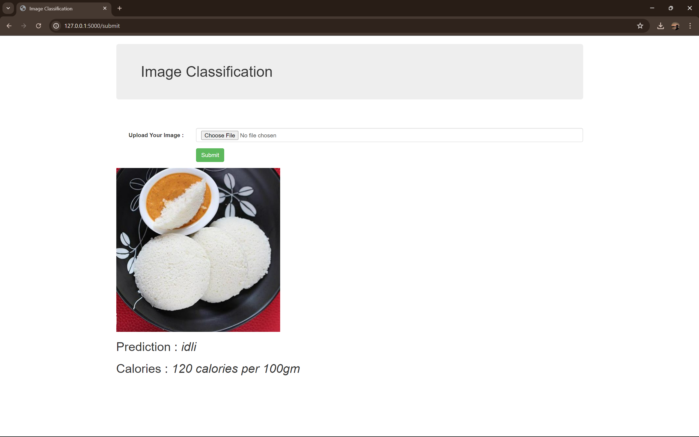
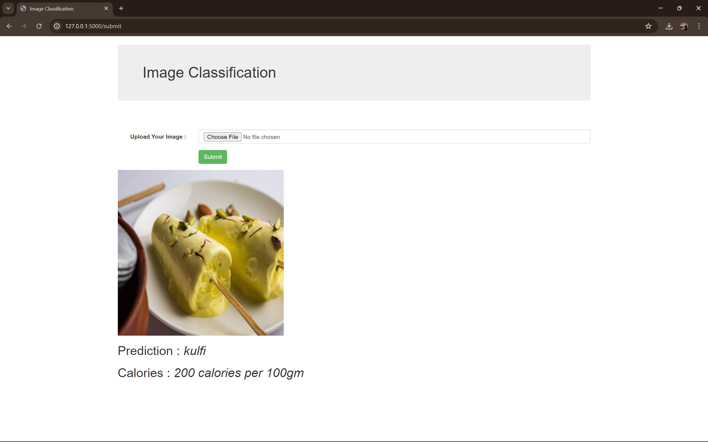

# Food Item Recognition System

This is a web application built using Flask and an Image classification Model trained using Convolutional Neural Network Architecture, to classify food images into different categories .

## Table of Contents

- [Installation](#installation)
- [Usage](#usage)
- [Project Structure](#project-structure)
- [Model Information](#model-information)

## Installation

1. Clone the repository:

```bash
git clone https://github.com/MrProgrammerr/Food_Recognition_CodeBase
cd Food_Recognition_CodeBase
```

2. Create a virtual environment and activate it:

```bash
python3 -m venv venv
source venv/bin/activate  # On Windows, use `venv\Scripts ctivate`
```

3. Install the required packages:

```bash
pip install -r requirements.txt
```

4. Place your trained Keras model (`my_model.h5`) in the `Models` directory.

## Usage

1. Run the Flask application:

```bash
python app.py
```

2. Open your web browser and go to `http://127.0.0.1:5000/`.

3. Upload an image and see the predicted category.

## Project Structure

```
image-classification-flask-app/
│
├── Models/
│   └── my_model.h5           # Pre-trained Keras model
│
├── static/
│   └── (uploaded images will be stored here)
│
├── templates/
│   └── index.html            # HTML template for the web application
│
├── app.py                    # Flask application code
├── requirements.txt          # List of dependencies
├── README.md                 # This README file
│
```

## Model Information

The model used in this project is trained on 20 types of Food Images using CNN for getting features from them and to classify them into 20 different categories:

- burger
- butter_naan
- chai
- chapati
- chole_bhature
- dal_makhani
- dhokla
- fried_rice
- idli
- jalebi
- kaathi_rolls
- kadai_paneer
- kulfi
- masala_dosa
- momos
- paani_puri
- pakode
- pav_bhaji
- pizza
- samosa

Ensure that the model file (`my_model.h5`) is placed in the `Models` directory.

## Screenshots
Here are some screenshots of the application:




